# SEC-001 - Enterprise SOC Engineering with Microsoft Sentinel

> OmniVerse Enterprise Engineering Portfolio

[Back to Portfolio](https://github.com/KSWISHA9)


## Executive Summary

This project demonstrates the deployment of Microsoft Sentinel as the enterprise SIEM for OmniVerse. Microsoft Entra ID authentication logs were ingested into a Log Analytics workspace, custom KQL detections were developed and validated, analytics rules were configured with MITRE ATT&CK mapping, and a simulated brute-force attack successfully generated a Sentinel incident that was investigated from detection through evidence analysis.

---

## Project Metrics

| Metric | Value |
|---|---|
| Screenshots | 12 |
| KQL Queries | 6 |
| Custom Analytics Rules | 1 |
| Generated Incidents | 1 |
| Completed Investigations | 1 |

## Evidence Links

- [View all screenshots](screenshots/)
- [Review KQL hunting queries](kql/)
- [Review the scheduled analytics rule](analytics-rules/SEC-001-Repeated-Failed-Signins.kql)

---

## Overview

Microsoft Sentinel SOC deployment with Entra ID log ingestion, KQL threat detection, custom analytics rules mapped to MITRE ATT&CK, and end-to-end incident investigation in the OmniVerse lab environment.

---

## What Was Built

A cloud-native SOC environment built on Microsoft Sentinel, ingesting Microsoft Entra ID sign-in logs into a Log Analytics workspace. A custom scheduled analytics rule was built to detect repeated failed sign-in attempts (brute force), mapped to MITRE ATT&CK T1110. The rule fired, generated a Sentinel incident, and the full investigation workflow was executed and documented.

---

## Architecture

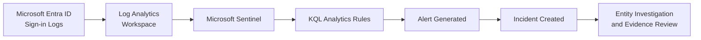

---

## Environment

| Component | Configuration |
|---|---|
| Resource Group | RG-SEC-001-SOC |
| Log Analytics Workspace | rg-sec-001-soc (East US) |
| SIEM | Microsoft Sentinel |
| Data Source | Microsoft Entra ID Sign-in Logs |
| Detection Rule | SEC-001 - Repeated Failed Sign-ins |
| MITRE ATT&CK | T1110 - Brute Force / Credential Access |
| Severity | Medium |
| Schedule | Every 5 minutes, 10 minute lookback |

---

## What This Proves

- Deployed Microsoft Sentinel on top of a Log Analytics workspace.
- Connected Microsoft Entra ID diagnostic logs for SOC visibility.
- Built KQL queries for ingestion validation, failed sign-in investigation, and brute-force detection.
- Created a custom scheduled analytics rule mapped to MITRE ATT&CK T1110.
- Generated and investigated a Sentinel incident with account entity evidence.
- Documented detection logic, triage context, lessons learned, and future SOC enhancements.

---

## Evidence Gallery

The screenshots below show the SOC build, detection engineering workflow, and incident investigation evidence. The complete evidence set is available in the [screenshots folder](screenshots/).

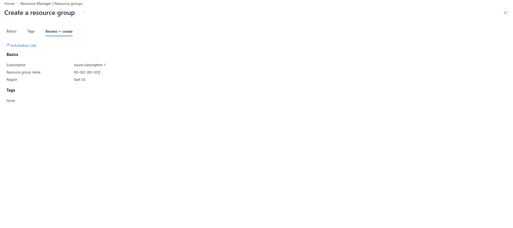

Resource group RG-SEC-001-SOC created in East US as the container for the Log Analytics workspace and Sentinel deployment.

---

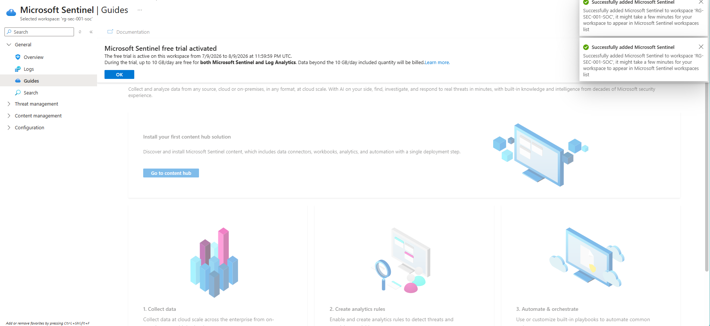

Microsoft Sentinel enabled on the workspace with the SIEM and SOAR capability stack available for detection and investigation workflows.

---

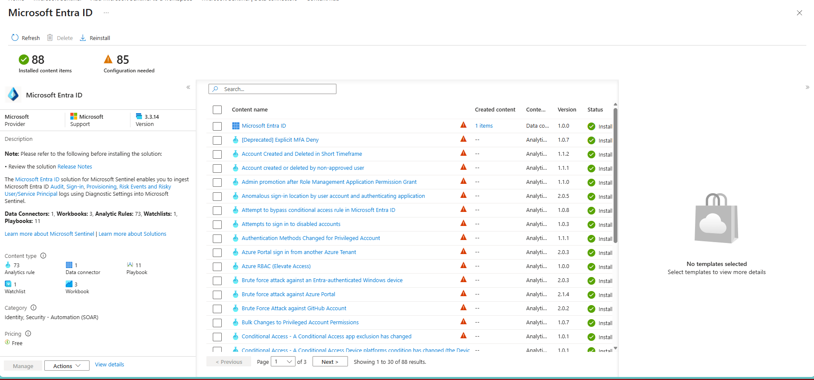

Microsoft Entra ID solution installed from Content Hub, including analytics rule templates, workbooks, playbooks, and the Entra ID data connector.

---

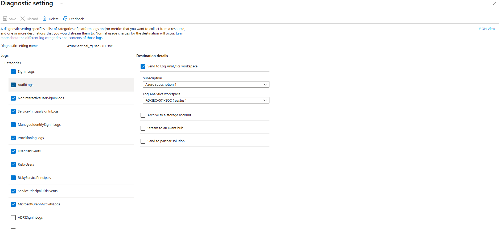

Entra ID diagnostic settings configured to stream SigninLogs, AuditLogs, NonInteractiveUserSignInLogs, ServicePrincipalSignInLogs, UserRiskEvents, RiskyUsers, and MicrosoftGraphActivityLogs to the Sentinel workspace.

---

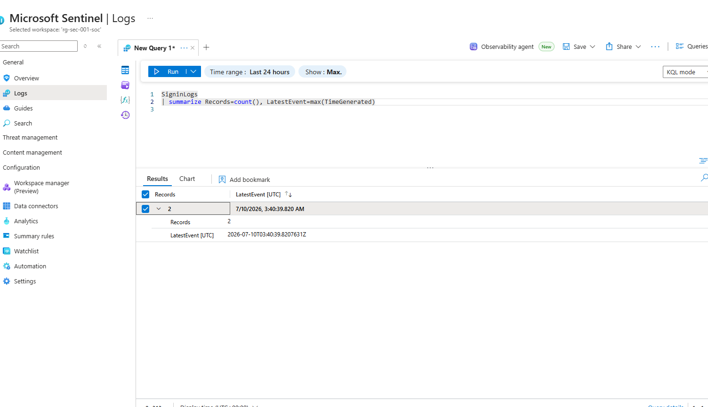

Log ingestion confirmed via KQL - SigninLogs returning records with a recent timestamp, validating data flow from Entra ID into the Sentinel workspace before building detection rules.

---

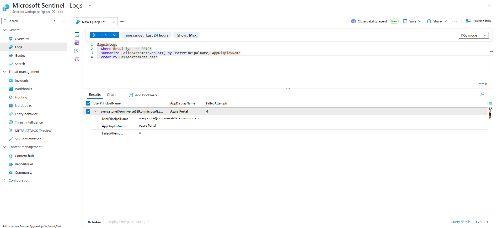

Brute force investigation query confirming avery.stone accumulated 4 failed authentication attempts against Azure Portal using ResultType 50126 - crossing the threshold defined in the detection rule.

---

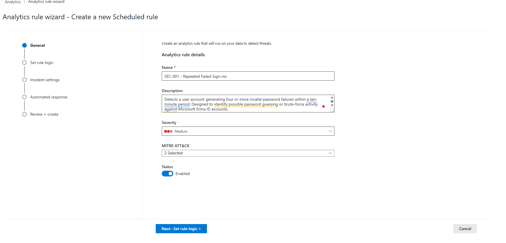

Custom analytics rule wizard - SEC-001 Repeated Failed Sign-ins configured with Medium severity, MITRE ATT&CK T1110 technique mapped, and Enabled status set before deployment.

---

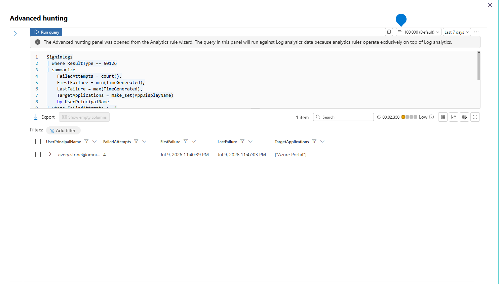

Detection KQL validated in Advanced hunting before rule deployment - avery.stone returned with FailedAttempts, FirstFailure, LastFailure, and TargetApplications confirming the logic produces the expected output.

---

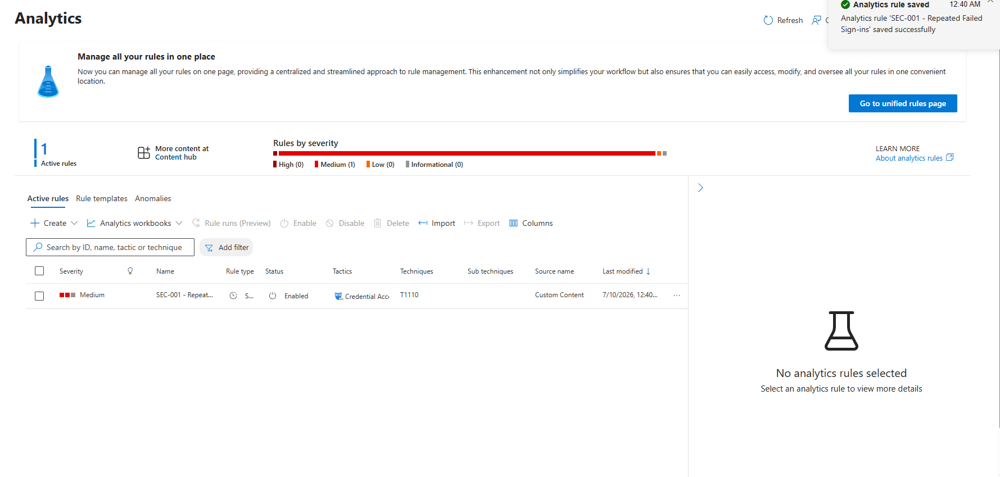

SEC-001 analytics rule saved and confirmed active - Medium severity, Credential Access tactic, T1110 technique, Scheduled type, running every 5 minutes.

---

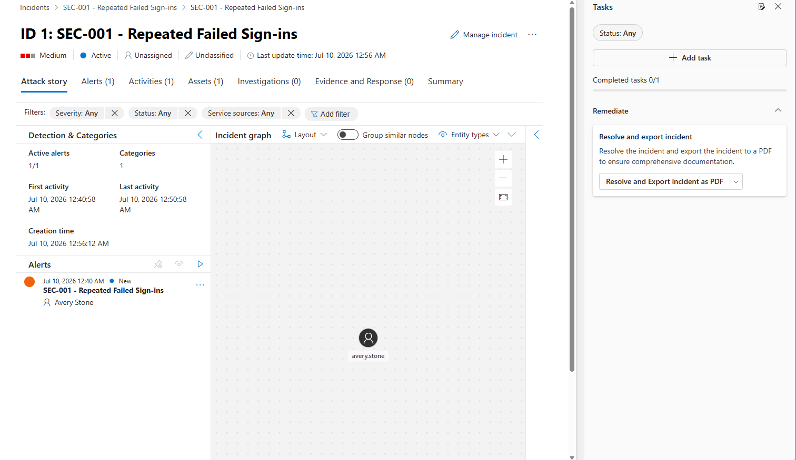

Sentinel Incident ID 1 automatically generated - SEC-001 Repeated Failed Sign-ins, Medium severity, Active status. Entity graph populated with avery.stone as the linked account.

---

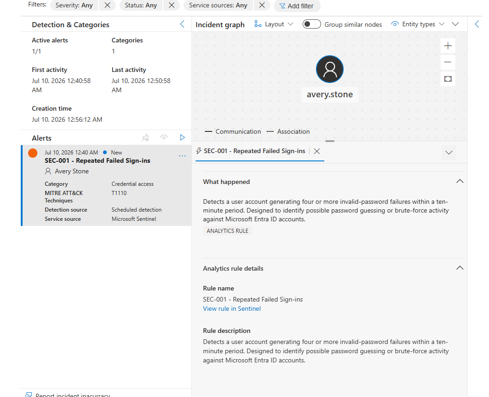

Incident investigation confirming the analytics rule details, entity graph, and the detection narrative - a user account generating four or more invalid-password failures within a ten-minute period mapped to T1110 Brute Force.

---

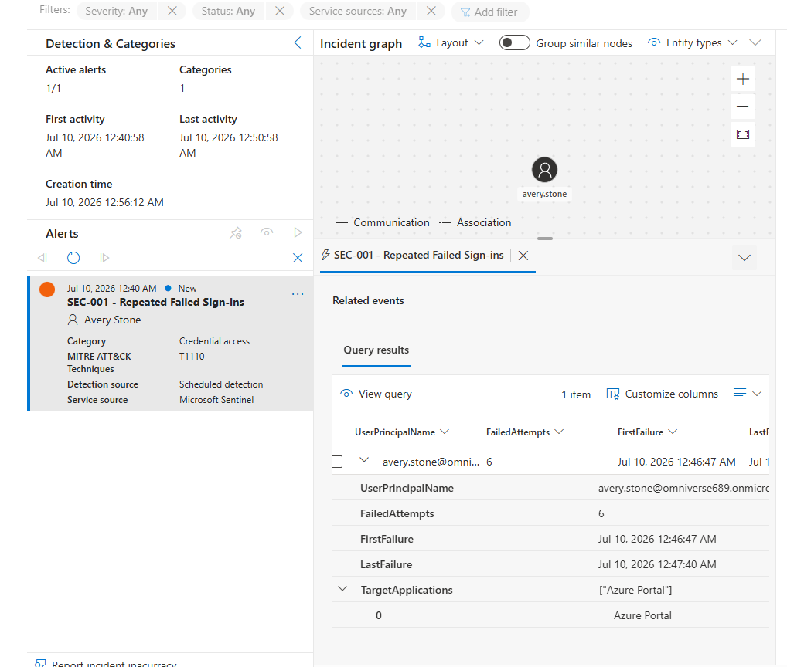

Final incident evidence - 6 failed attempts for avery.stone between 12:46 and 12:47 AM targeting Azure Portal. MITRE ATT&CK T1110 Credential Access confirmed. Investigation complete.

---

## Detection Rule

```kql
// SEC-001 - Repeated Failed Sign-ins
// MITRE ATT&CK: T1110 - Brute Force
// Severity: Medium | Schedule: Every 5 min | Lookback: 10 min
SigninLogs
| where ResultType == 50126
| summarize
    FailedAttempts = count(),
    FirstFailure = min(TimeGenerated),
    LastFailure = max(TimeGenerated),
    TargetApplications = make_set(AppDisplayName)
  by UserPrincipalName
| where FailedAttempts > 4
```

**Why ResultType 50126:** This is the Entra ID error code for invalid username or password - the most reliable signal for password guessing and brute force activity.

**Why threshold of 4:** Balances sensitivity with false positive reduction. Four failures within ten minutes is anomalous for normal user behavior but avoids alerting on a single mistyped password.

---

## KQL Library

| Query | Purpose |
|---|---|
| [01-ingestion-validation.kql](kql/01-ingestion-validation.kql) | Confirms log ingestion and data freshness |
| [02-failed-auth-investigation.kql](kql/02-failed-auth-investigation.kql) | Surfaces failed sign-in events with context |
| [03-brute-force-summary.kql](kql/03-brute-force-summary.kql) | Summarizes failed attempts by user and app |
| [04-authentication-methods.kql](kql/04-authentication-methods.kql) | Breaks down authentication strength distribution |
| [05-successful-auth-timeline.kql](kql/05-successful-auth-timeline.kql) | Shows successful sign-ins with method detail |
| [SEC-001-Repeated-Failed-Signins.kql](analytics-rules/SEC-001-Repeated-Failed-Signins.kql) | Custom scheduled detection rule |

---

## Incident Timeline

| Time | Event |
|---|---|
| Jul 10 12:46 AM | Failed sign-in sequence observed |
| Jul 10 12:47 AM | Detection threshold crossed |
| Jul 10 12:47 AM | Last failure recorded |
| Jul 10 12:56 AM | Sentinel incident automatically created |
| Investigation | Entity confirmed, evidence reviewed, case documented |

---

## Skills Demonstrated

- Microsoft Sentinel Deployment
- Log Analytics Workspace Configuration
- Entra ID Data Connector and Diagnostic Settings
- KQL Threat Hunting and Detection Engineering
- Custom Analytics Rule Development
- MITRE ATT&CK Framework Mapping (T1110)
- Entity Mapping and Custom Alert Details
- Scheduled Rule Configuration
- Incident Investigation and Evidence Review
- Cloud SIEM Operations

---

## Lessons Learned

- SigninLogs require explicit enablement in the diagnostic settings - they do not stream automatically through the data connector alone.
- ResultType 50126 is the most reliable brute force signal in Entra ID logs. Not all failure codes indicate credential attacks.
- Entity mapping in the analytics rule is what populates the incident graph. Without it Sentinel creates the incident but cannot link the user entity.
- Custom details surfacing FailedAttempts, FirstFailure, and LastFailure in the alert removes the need to re-run queries during triage.
- Validate detection KQL in Advanced hunting before saving the rule - the query editor in the rule wizard has less context than the full hunting interface.

---

## Future Enhancements

- Additional rules: impossible travel (T1078), mass download, anonymous IP sign-in
- Logic Apps playbook for automatic account disable on confirmed brute force
- Microsoft Sentinel Workbook for SOC operations dashboard
- UEBA integration for behavioral anomaly detection
- Watchlist for known malicious IP ranges
- Integration with IAM-004 Conditional Access for automated response

---

## Related Projects

| Project | Description |
|---|---|
| [IAM-004 Conditional Access and Zero Trust](https://github.com/KSWISHA9/IAM-004-Conditional-Access-Zero-Trust) | MFA, CA policies, named locations |
| [IAM-005 Identity Governance](https://github.com/KSWISHA9/IAM-005-Identity-Governance) | PIM, Access Reviews, Entitlement Management |
| [IAM-006 Identity Operations and Risk Analytics](https://github.com/KSWISHA9/IAM-006-Enterprise-Identity-Operations-Risk-Analytics) | Risk scoring, dashboards, remediation |

---

Created by **Keshawn Lynch**

